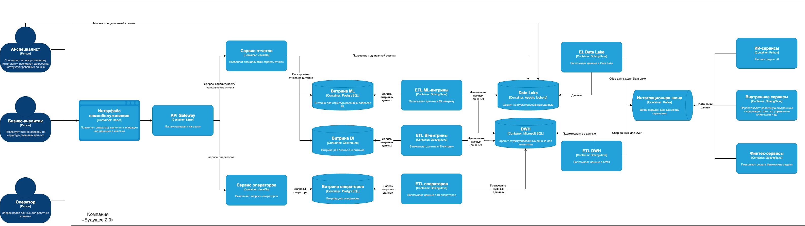

# Задание 1

## 1. Спроектированная архитектура системы через год

#### Особенности спроектированной системы:

1. Имеет DWH как источник структурированной информации для BI, операторов и аналитиков
2. Имеет Data Lake для улучшения работы AI-помощника и запросов АI-специалистов
3. Использована двухуровневая архитектура (DWH + Data Lake), а не Data Lakehouse, чтобы не тратить время и силы на
   модификацию уже имеющегося DWH, и в силу того, что DataLakehouse имеет не так много известных промышленных
   применений
4. Для групп-пользователей выделены витрины данных, структуру данных в которых можно настроить посредством настройки ETL
5. ETL отбирает данные таким образом, что в витрины не попадает чувствительная информация
6. Сервис операторов и сервис отчетов регулируют доступ отдельных групп пользователей у системе, способны проверять
   права групп пользователей
7. Реализован общий портал самообслуживания на React, посредством которого разные группы пользователей могут запрашивать
   данные и строить отчеты
8. Масштабирование системы возможно посредством добавления новых витрин настройки новых ETL-пайплайнов
9. Добавление витрин повысит быстродействие системы, тк сократит скорость выполнения запросов
10. Витрины можно делать различными по структуре, например, можно использовать Clickhouse для тяжелых аналитических
    запросов
11. Удалено использование BI-системы, она заменена единым интерфейсом для запросов и составления отчетов.
12. Apache Camel заменена на Kafka для повышения скорости разработки и соответствия современным стандартам
13. Удален клиентский интерфейс оператора в силу замены его функций порталом саообслуживания

## 2. Проблемные места

#### В текущей системе AS IS найдены следующие проблемные места:

1. Долгое выполнение запросов по отчетам из-за растущего объема данных
2. Хранение только структурированных данных, хотя в компании присутствует AI
3. BI и операторы используют систему, которая имеет доступ к чувствительным данным, так как все данные лежат в одном
   месте в DWH, преобразование же чувствительных данных "по факту использования" может занимать более длительное время
   формирования запроса
4. Слой интеграций использует старую шину данных, что увеличивает время разработки и снижает time to market
5. DWH на базе Microsoft SQL-сервера 2008 - официальная поддержка Microsoft SQL Server 2008 завершилась ещё в январе
   2019 года.
5. Отсутствие единого интерфейса для взаимодействия с потребителями данных

## 3. Приоретизация выявленных проблем

#### Метод MoSCoW:

- **Проблема 1 -> Решение: Создание витрин для отдельных категорий пользователей**: Must have
- **Проблема 2 -> Решение: Создание Data lake**: Should have
- **Проблема 3 -> Решение: Создание витрин для отдельных категорий пользователей**: Must have
- **Проблема 4 -> Решение: Переход на современное решение - Kafka и создание ETL-пайплайнов**: Should have
- **Проблема 5 -> Решение: Обновление Microsoft SQL-сервера до современных версий**: Could have
- **Проблема 6 -> Решение: Создание единого портала самообслуживания**: Must have