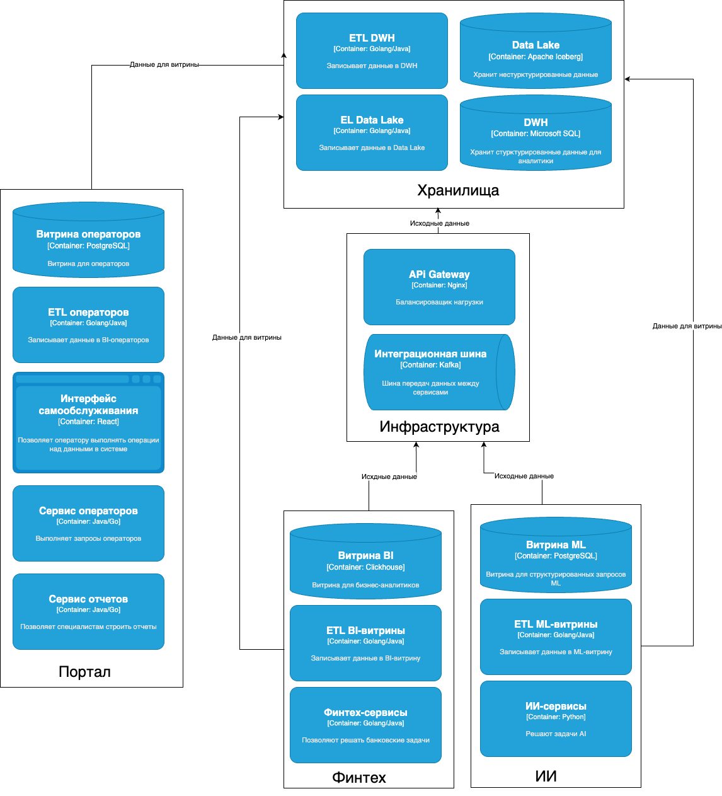

# Задание 2

## Разделение системы на домены с описанием потоков данных между ними

## Аргументация логики разделения на домены

1) Домены разделены таким образом, что каждый домен занимается максимально только зоной своей ответственности
2) Домены разделены таким образом, что потоков данных между доменами совсем немного: это или отдача исходного материала,
   либо получение данных из хранилища для подготовки витрины - снижается кросс-командное взаимодействие
3) Добавление новой функциональности может быть выделено в отдельный домен, не затрагивая уже существующие домены
4) Изменение доменов не заставляет переделывать DWH - изменения минимальные в рамках инфраструктуры