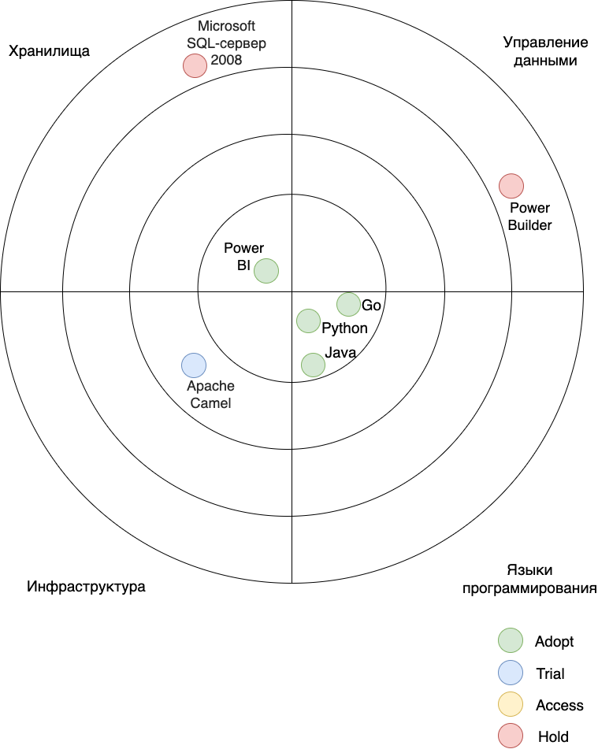
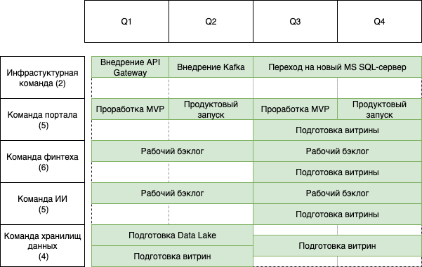

# Задание 3

## 1. Технический радар

## 2. Роадмап

### Результаты:

**Результаты Q1:**

- API Gateway поднят и протестирован
- Разработан MVP интерфейса самообслуживания
- Разработан MVP сервиса отчетов
- Начато внедрение Data Lake
- Начата подготовка витрины BI

**Результаты Q2:**

- Kafka поднята и протестирована
- Сервис отчетов в проде
- Интерфейс самообслуживания в проде
- Витрина BI в проде
- Data Lake внедрено и протестировано
- Подготовлен и протестирован ETL для DWH

**Результаты Q3:**

- Подготовлен и протестирован EL для Data Lake
- Начата подготовка витрины операторов
- Начата проработка MVP сервиса операторов
- Начата подготовка витрины ML
- Начат переход на новый MS SQL

**Результаты Q4:**

- Витрина операторов в проде
- MVP сервиса операторов в проде
- Витрина ML в проде
- Новый MS SQL в проде

## 3. Обоснование изменений

- 1 Квартал: Начата проработка основных концепций и то, что можно построить на текущих системах: это отчеты для BI,
  витрина для BI. Начинают подниматься новые сервисы API Gateway, Data Lake.
- 2 Квартал: Все работы, начатые в 1 квартале окончены, BI уже может тестировать интерфейс самообслуживания, так как для
  него все готово, параллельно оценивается удобство использования интерфейса. Data Lake реализовано, для него начинает
  готовится EL.
- 3 квартал: Data Lake полноценно функционирует, готовится витрина и сервис для операторов и AI-специалистов.
  Параллельно есть время на улучшения - обновление устаревшего хранилища
- 4 квартал: Завершающие работы: витрина и сервис операторов функционируют, ими пользуются операторы, аналогично
  работает AI-системы. Все запланированые работы сделаны.